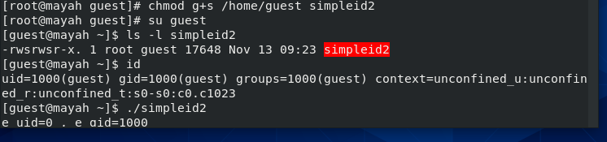
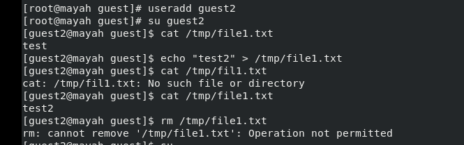

# Отчёт по лабораторной работе 5
## Дискреционное разграничение прав в Linux. Исследование влияния дополнительных атрибутов

### Хамарнех Майя Ясер

## Содержание

#### 1. Цель работы		
#### 2. Выполнение лабораторной работы	
#### 3. Выводы

### 1. Цель работы
Изучение механизмов изменения идентификаторов, применения SetUID- и Sticky-битов. Получение практических навыков работы в консоли с дополнитель- ными атрибутами. Рассмотрение работы механизма смены идентификатора процессов пользователей, а также влияние бита Sticky на запись и удаление файлов.

### 2. Выполнение лабораторной работы

 at first I disabled the SELinux system. 

  

от пользователя-гостя я создалa файл c с именем simpleid.c , а затем я написалa файл и скомпилировалa его
после этого я запустилa программу, затем запустил команду "id" и сравнилa результаты обоих, и оба результата были идентичны

  
  

Я создалa другой файл с именем simpleid2, произвел дублирование программы (simpleid), добавив выходные данные действительных идентификаторов, затем я скомпилировалa и запустилa simpleid2.c.

  

Я переключился на пользователя root и изменилa владельца файла simpleid2.c на root, пока группа все еще является guest, используя:

`chown root:guest /home/guest/simpleid2 `

затем я изменил режим на SUID, чтобы дать пользователю временные разрешения на запуск simpleid2 с разрешениями владельца файла и root, а не пользователя, который его запускает

`chmod u + s / домашний / гость / simpleid2`

  

от гостя мы проверили с помощью команды ls новые атрибуты и владельца
затем мы скомпилировали и запустили файл, затем мы запустили команду id и сравнили оба результата, чтобы увидеть, что теперь он принадлежит root

  

Проделалa тоже самое относительно SetGID-бита.

  

затем мы написали файл readfile.c для чтения файла и скомпилировали его

  

затем мы изменили владельца файла на root и дали права на чтение только root, а не гостю или другим пользователям:

  

мы проверили, может ли пользователь guest прочитать его, и он не смог

  

мы изменили владельца прочитанного файла и установили бит SetUiD.

  

мы проверили, может ли файл reafile прочитать readfile.c, и он сработал

  

мы снова проверили, может ли прочитанный файл прочитать файл / etc / shadow, и он сработал

  

мы проверили, установлен ли атрибут Sticky в каталоге / tmp, и он установил.
 Используя ls -l / | grep tmp
затем от имени гостя мы создали файл file01.txt в каталоге / tmp и написали слово "test" внутри этого файла.
затем мы проверили атрибуты вновь созданного файла и разрешили чтение и запись для остальных

  

  

мы добавили еще одного пользователя по имени guest2 и оттуда мы попытались добавить несколько слов в файл file1.txt в tmp, каждый раз, когда мы писали слово, он показывал нам это слово, стирая все предыдущие слова
но когда мы пытались удалить файл, он не давал нам на это разрешения

  

затем мы удалили липкий бит, чтобы у него были разрешения, и мы повторили некоторые шаги и попытались удалить файл впоследствии, и это сработало, файл был удален

  

используя корень суперпользователя, мы вернули липкий бит chmod + t и вышли

  

### 3. Вывод
мы узнали все о SUID и липких битах, а также о том, как их использовать для изменения разрешений в системе и между пользователями.
также как тщательно проверять эти атрибуты и разрешения и перемещаться между пользователями
